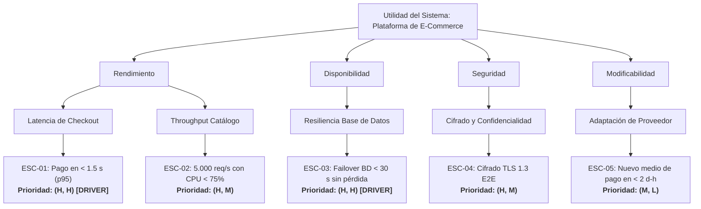

# Especificación del Árbol de Utilidad (Utility Tree) - Metodología ATAM

Este documento describe la estructura jerárquica, la matriz bidimensional de priorización y las pautas de representación del **Árbol de Utilidad** (*Utility Tree*), componente central del método de evaluación de arquitecturas **ATAM** (*Architecture Tradeoff Analysis Method*) desarrollado por el Software Engineering Institute (SEI).

---

## 1. Propósito y Fundamento en ATAM

El Árbol de Utilidad es el instrumento que permite traducir los objetivos de negocio y la visión abstracta de calidad de un sistema en requerimientos arquitectónicos concretos, priorizados y medibles. 

Su función principal es:
1. **Operacionalizar la "Utilidad":** Descomponer la calidad global en dimensiones evaluables.
2. **Priorizar el Esfuerzo de Diseño:** Focalizar la atención de arquitectos e ingenieros en los escenarios de mayor valor de negocio y mayor complejidad técnica.
3. **Identificar Puntos de Sensibilidad y Tradeoffs:** Servir de base para relacionar decisiones de diseño con múltiples atributos de calidad potencialmente conflictivos (ej. Seguridad vs. Rendimiento).

---

## 2. Estructura Jerárquica Formal (4 Niveles)

El árbol se estructura en una jerarquía estricta de cuatro niveles descendentes:

```text
[ Nivel 0: UTILIDAD GLOBAL DEL SISTEMA ]
                   │
   ┌───────────────┴───────────────┐
   ▼                               ▼
[ Nivel 1: Atributo A ]        [ Nivel 1: Atributo B ]
   │                               │
   ├───────────────┐               └───────────────┐
   ▼               ▼                               ▼
( Nivel 2: Sub-A1 ) ( Nivel 2: Sub-A2 )         ( Nivel 2: Sub-B1 )
   │               │                               │
   ▼               ▼                               ▼
[ Nivel 3: ESC-01 ] [ Nivel 3: ESC-02 ]         [ Nivel 3: ESC-03 ]
     (H, H)              (H, M)                      (M, L)
```

1. **Nivel 0 - Raíz (Utilidad):** Representa el valor global, la adecuación y la excelencia operativa del sistema bajo análisis.
2. **Nivel 1 - Atributos de Calidad de Alto Nivel:** Las grandes propiedades no funcionales según el SEI (Rendimiento, Disponibilidad, Desplegabilidad, Seguridad, Modificabilidad, Safety / Inocuidad, Integrabilidad, Escalabilidad, Testabilidad, Usabilidad, Interoperabilidad).
3. **Nivel 2 - Sub-atributos o Refinamientos:** Categorías específicas o aspectos concretos dentro de cada atributo. Ejemplos:
   * *Rendimiento:* Latencia en horario pico, Rendimiento transaccional (Throughput), Tiempo de arranque.
   * *Disponibilidad:* Resiliencia ante fallas de hardware, Recuperación ante caída de red, Preservación de transacciones en vuelo.
   * *Desplegabilidad:* Despliegue zero-downtime, Tiempo transcurrido de release (*elapsed time*), Rollback automatizado, Incorporación de componentes de terceros sin defectos.
   * *Seguridad:* Confidencialidad en reposo/tránsito, Prevención de intrusiones, Trazabilidad/Auditoría forense.
   * *Safety:* Prevención de peligros (*hazards*), Mitigación ante fallas de sensores críticos para la vida, Transición a modo seguro (*fail-safe* / sensores de respaldo).
   * *Integrabilidad:* Compatibilidad con componentes de terceros/marketplace, Esfuerzo de adaptación de módulos COTS, Estandarización de interfaces y conectores.
   * *Modificabilidad:* Refactorización modular, Cambios en esquemas de datos, Soporte de nuevos contratos de API.
4. **Nivel 3 - Escenarios Especificados (Hojas):** Requerimientos concretos expresados como escenarios de calidad de 6 partes (o resumen representativo), acompañados por un identificador único (ej. `ESC-01`, `ESC-02`) y su tupla de priorización.

---

## 3. Matriz Bidimensional de Priorización del SEI

Cada escenario hoja del árbol de utilidad es evaluado y calificado mediante una tupla de dos valores:

$$\mathbf{(Importancia\ para\ el\ Negocio,\ Dificultad\ o\ Riesgo\ Técnico)}$$

Ambas dimensiones adoptan valores discretos de tres niveles:
* **H (High / Alto)**
* **M (Medium / Medio)**
* **L (Low / Bajo)**

### 3.1 Criterios de Evaluación

| Dimensión | Evaluador Responsable | Pregunta Clave de Evaluación |
| :--- | :--- | :--- |
| **Importancia para el Negocio** | *Product Owner*, Stakeholders de negocio, Clientes. | Si este escenario no se cumple o se degrada, ¿cuánto sufre el modelo de negocio, la reputación, los ingresos o la misión crítica del sistema? |
| **Dificultad o Riesgo Técnico** | *Software Architect*, Tech Leads, Equipo de Ingeniería. | ¿Cuán complejo, costoso, novedoso o riesgoso resulta satisfacer este escenario dada la arquitectura, tecnologías y experiencia del equipo? |

### 3.2 Cuadrantes y Toma de Decisiones Arquitectónicas

| Tupla | Clasificación | Significado y Táctica de Abordaje |
| :---: | :--- | :--- |
| **(H, H)** | **Driver Arquitectónico Crítico** | **Máxima prioridad absoluta.** Define la estructura central del sistema. Requiere diseño de tácticas específicas, prototipado temprano (*architectural spikes*), evaluación formal de tradeoffs y pruebas de carga rigurosas. |
| **(H, M)** | **Requerimiento Primario** | Alta relevancia para el negocio pero con soluciones técnicas estándar o conocidas. Se implementa aplicando patrones arquitectónicos consolidados. |
| **(M, H)** | **Riesgo Técnico Latente** | Dificultad técnica alta aunque el impacto de negocio sea moderado. Requiere vigilancia para evitar sobre-ingeniería innecesaria (*over-engineering*) o simplificar la solución. |
| **(M, M)** | **Requerimiento Estándar** | Impacto y esfuerzo moderados. Se aborda mediante prácticas de desarrollo convencionales. |
| **(L, \*)** | **Requerimiento Secundario** | Baja relevancia para el negocio. No debe condicionar la arquitectura ni justificar patrones complejos. |

---

## 4. Esquemas de Representación

Para garantizar máxima claridad en informes y revisiones de diseño, el árbol de utilidad se representa en dos formatos complementarios:

### 4.1 Formato Tabular Jerárquico (Markdown)

```markdown
| Atributo de Calidad | Sub-atributo / Categoría | ID | Escenario Resumido | Prioridad (Negocio, Riesgo) |
| :--- | :--- | :--- | :--- | :---: |
| **Rendimiento** | Latencia de Checkout | ESC-01 | Usuario procesa orden de compra durante pico de ventas; respuesta en < 1.5 s en p95. | **(H, H)** |
| **Rendimiento** | Throughput de Catálogo | ESC-02 | Clientes consultan catálogo; soporte de 5.000 req/s con CPU < 75%. | **(H, M)** |
| **Disponibilidad** | Resiliencia de Base de Datos | ESC-03 | Caída de nodo primario de BD; failover automático a réplica en < 30 s sin pérdida de datos. | **(H, H)** |
| **Seguridad** | Cifrado y Confidencialidad | ESC-04 | Transmisión de datos de tarjeta; cifrado TLS 1.3 de extremo a extremo sin fugas. | **(H, M)** |
| **Modificabilidad** | Adaptación de Proveedor | ESC-05 | Incorporación de nuevo medio de pago en < 2 días-hombre sin alterar core de checkout. | **(M, L)** |
```

### 4.2 Visualización en Diagrama Mermaid


