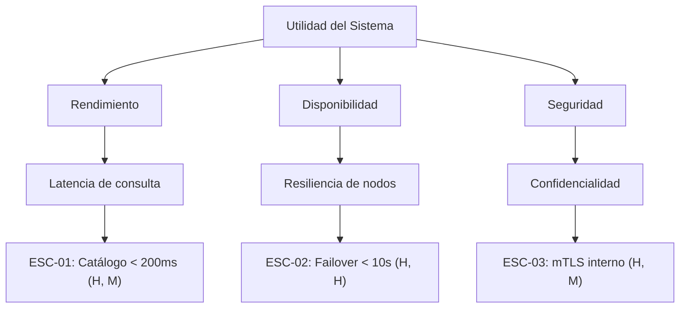

# Guía para la Elaboración del Árbol de Utilidad (Utility Tree)

El **Árbol de Utilidad** (*Utility Tree*) es una herramienta del método ATAM (*Architecture Tradeoff Analysis Method*) del SEI para explicitar, priorizar y operacionalizar los requerimientos no funcionales (atributos de calidad) del sistema.

---

## Estructura Jerárquica

El árbol descompone la noción abstracta de "bondad" o "utilidad" del sistema en escenarios medibles:

```
Utilidad (Raíz)
├── Atributo de Calidad (Nivel 1: ej. Rendimiento)
│   ├── Sub-atributo / Refinamiento (Nivel 2: ej. Latencia de transacción)
│   │   └── Escenario Específico (Nivel 3: ej. ESC-01) [Prioridad: (H, M)]
│   └── Sub-atributo / Refinamiento (Nivel 2: ej. Rendimiento bajo sobrecarga)
│       └── Escenario Específico (Nivel 3: ej. ESC-02) [Prioridad: (M, L)]
└── Atributo de Calidad (Nivel 1: ej. Disponibilidad)
    └── Sub-atributo / Refinamiento (Nivel 2: ej. Tolerancia a fallos de BD)
        └── Escenario Específico (Nivel 3: ej. ESC-03) [Prioridad: (H, H)]
```

---

## Esquema de Priorización (Matriz 2D)

Cada escenario en las hojas del árbol debe calificarse con una tupla de dos dimensiones:

$$\text{(Importancia para el Negocio / Arquitectura, Dificultad / Riesgo Técnico)}$$

Valores posibles para cada dimensión:
* **H (High / Alto)**
* **M (Medium / Medio)**
* **L (Low / Bajo)**

### Interpretación de Cuadrantes

| Prioridad | Significado Arquitectónico | Acción en el Diseño |
| :---: | :--- | :--- |
| **(H, H)** | **Crítico**: Alta importancia de negocio y alto riesgo/dificultad técnica. | Son los principales **drivers arquitectónicos**. Requieren análisis detallado, tácticas específicas y validación temprana (prototipos, spikes). |
| **(H, M)** | **Importante**: Alta importancia pero dificultad moderada. | Deben abordarse con patrones arquitectónicos establecidos. |
| **(M, H)** | **Riesgoso**: Dificultad alta aunque el impacto de negocio sea moderado. | Vigilar de cerca; evaluar si simplificar o mitigar el riesgo. |
| **(M, M)** | **Estándar**: Impacto y esfuerzo moderados. | Soluciones convencionales de ingeniería. |
| **(L, \*)** | **Secundario**: Baja relevancia para el negocio. | No deben justificar complejidades arquitectónicas innecesarias. |

---

## Formato de Representación en Markdown

Se recomienda presentar el árbol de utilidad en formato tabla para claridad de prioridades, y opcionalmente en diagrama Mermaid:

### 1. Tabla de Árbol de Utilidad

| Atributo de Calidad | Sub-atributo / Categoría | ID | Escenario Resumido | Prioridad (Negocio, Riesgo) |
| :--- | :--- | :--- | :--- | :---: |
| **Rendimiento** | Latencia de consulta | ESC-01 | Usuario consulta catálogo bajo carga pico (10.000 req/s); respuesta en < 200 ms. | **(H, M)** |
| **Disponibilidad** | Resiliencia ante caída de nodo | ESC-02 | Falla inesperada de un nodo del cluster; conmutación por error automática en < 10 s sin pérdida de transacciones confirmadas. | **(H, H)** |
| **Seguridad** | Confidencialidad de datos | ESC-03 | Intento de intercepción de tráfico entre microservicios; comunicación encriptada mediante TLS mTLS. | **(H, M)** |
| **Modificabilidad** | Integración de nuevo proveedor | ESC-04 | Desarrollador añade una nueva pasarela de pago; el cambio toma ≤ 2 días-hombre sin modificar el core de facturación. | **(M, M)** |

---

### 2. Diagrama Mermaid


