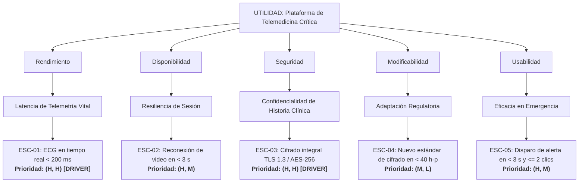

# Banco de Ejemplos de Escenarios SEI, Auditorías y Árboles de Utilidad

Este archivo reúne ejemplos de referencia para la formulación de escenarios de calidad de 6 partes según el SEI, casos prácticos de auditoría y corrección, y la construcción de árboles de utilidad priorizados.

---

## 1. Ejemplos de Escenarios de 6 Partes por Atributo

### 1.1 Rendimiento (Performance) - E-Commerce en Black Friday
* **Fuente del estímulo:** Clientes concurrentes en la plataforma de compras.
* **Estímulo:** Solicitud masiva de procesamiento de órdenes de pago durante pico estacional de ventas (12.000 req/min).
* **Artefacto:** Pasarela de Pagos y Servicio de Transacciones de Compra.
* **Entorno:** Evento de Alta Concurrencia (Black Friday) / Carga pico proyectada del 350% sobre la media.
* **Respuesta:** El sistema procesa pagos asíncronamente mediante colas de eventos, escala horizontalmente los workers de cobro y confirma la recepción al cliente.
* **Medida de respuesta:** Latencia p95 $\le 1.5\text{ segundos}$; throughput sostenido de $5.000\text{ TPS}$; $0\%$ de transacciones perdidas o no procesadas.

### 1.2 Disponibilidad (Availability) - Falla en Base de Datos Primaria
* **Fuente del estímulo:** Controlador de hardware o watchdog de la instancia primaria de base de datos.
* **Estímulo:** Falla imprevista del servidor de base de datos primario (caída total de proceso/host).
* **Artefacto:** Cluster de Base de Datos relacional transaccional.
* **Entorno:** Operación normal de producción con transacciones activas en vuelo.
* **Respuesta:** El orquestador de alta disponibilidad detecta la pérdida de heartbeat en $\le 3\text{ s}$, aísla el nodo caído, promueve la réplica sincrónica a nodo primario y redirige el pool de conexiones.
* **Medida de respuesta:** Tiempo de indisponibilidad total ($\text{RTO}) \le 15\text{ segundos}$; cero pérdida de transacciones confirmadas ($\text{RPO} = 0$).

### 1.3 Seguridad (Security) - Intrusión e Inyección en API Pública
* **Fuente del estímulo:** Atacante externo no autenticado desde red pública.
* **Estímulo:** Envío de ráfaga de peticiones malformadas con vectores de inyección SQL y robo de tokens JWT.
* **Artefacto:** API Gateway y servicio de validación de autenticación.
* **Entorno:** Operación en red pública bajo ataque activo.
* **Respuesta:** El WAF inspecciona los payloads, detecta la firma maliciosa, bloquea la dirección IP de origen, descarta las peticiones y emite una alerta crítica al SIEM de seguridad.
* **Medida de respuesta:** $100\%$ de las peticiones maliciosas bloqueadas sin alcanzar los servicios internos; registro inmutable de auditoría generado en $\le 40\text{ ms}$; tiempo de bloqueo de IP $\le 1\text{ segundo}$.

### 1.4 Modificabilidad (Modifiability) - Incorporación de Pasarela de Pago
* **Fuente del estímulo:** Desarrollador del equipo de backend.
* **Estímulo:** Requerimiento de incorporar una nueva pasarela de cobro internacional (ej. Stripe o MercadoPago).
* **Artefacto:** Módulo adaptador de pagos y configuración de enrutamiento transaccional.
* **Entorno:** Ciclo de sprint de desarrollo / fase de mantenimiento evolutivo.
* **Respuesta:** El desarrollador implementa la interfaz genérica `PaymentProviderAdapter` existente y registra la nueva pasarela mediante inyección de dependencias sin modificar la lógica central del core de checkout.
* **Medida de respuesta:** Esfuerzo de desarrollo $\le 16\text{ horas-persona}$; cero modificaciones a clases del núcleo de facturación; tests automatizados de regresión pasando al $100\%$ en $\le 5\text{ minutos}$.

### 1.5 Testabilidad (Testability) - Verificación de Reglas Contables
* **Fuente del estímulo:** Ingeniero de QA / Pipeline de Integración Continua (CI).
* **Estímulo:** Ejecución automatizada de suite de pruebas de regresión e inyección de fallas sobre el cálculo impositivo.
* **Artefacto:** Motor de liquidación impositiva y microservicio contable.
* **Entorno:** Pipeline de CI/CD sobre entorno efímero de pruebas.
* **Respuesta:** El motor expone puntos de inyección de tasas y fechas mediante stubs, permitiendo simular escenarios de borde y recolectar cobertura determinista.
* **Medida de respuesta:** Cobertura de código en ramas $\ge 90\%$; ejecución total de la suite en $\le 3\text{ minutos}$; identificación de discrepancias con traza observable en el $100\%$ de los fallos.

---

## 2. Casos Prácticos de Auditoría y Corrección

### Caso de Auditoría A: Transacciones Falsas en Banca
* **Texto Original Provisto (Deficiente):**
  > *"Un hacker intenta hacer transacciones falsas pero el sistema bancario lo detecta y no se cae."*

* **Diagnóstico de Deficiencias:**
  * ⚠️ **Fuente:** Parcial (*"un hacker"* $\rightarrow$ conviene precisar: atacante externo no autenticado).
  * ⚠️ **Estímulo:** Impreciso (*"hacer transacciones falsas"* $\rightarrow$ ¿mediante inyección de paquetes, credenciales robadas o replay?).
  * ❌ **Artefacto:** Genérico (*"el sistema bancario"* $\rightarrow$ viola delimitación arquitectónica).
  * ❌ **Entorno:** Ausente (no se especifica estado del sistema).
  * ⚠️ **Respuesta:** Parcial (*"lo detecta y no se cae"* $\rightarrow$ falta táctica de mitigación, bloqueo y auditoría).
  * ❌ **Medida de Respuesta:** Totalmente ambigua (*"no se cae"* no cuantifica disponibilidad, detección ni tolerancia).

* **Escenario Corregido Aplicando Reglas de Inferencia Segura:**
  | Parte | Especificación Formal Auditada |
  | :--- | :--- |
  | **Fuente del estímulo** | Atacante externo no autenticado en red pública. |
  | **Estímulo** | Intento de inyección de transacciones no autenticadas con credenciales forjadas. |
  | **Artefacto** | API Gateway de Transacciones y Motor de Detección de Fraude del Core Bancario. |
  | **Entorno** | Operación normal en régimen de producción nominal. |
  | **Respuesta** | El motor de fraude rechaza la transacción espuria, revoca tokens asociados, bloquea la dirección IP de origen y despacha una alerta al centro de operaciones de seguridad (SOC). |
  | **Medida de respuesta** | $100\%$ de los intentos fraudulentos bloqueados; traza de auditoría generada en $\le 50\text{ ms}$; disponibilidad del servicio de transacciones legítimas mantenida al $99.999\%$ sin caídas. |

---

### Caso de Auditoría B: Búsqueda Rápida en Catálogo
* **Texto Original Provisto (Deficiente):**
  > *"El buscador tiene que andar rápido cuando busca la gente."*

* **Diagnóstico de Deficiencias:**
  * ⚠️ **Fuente:** Imprecisa (*"la gente"* $\rightarrow$ clientes web/móviles concurrentes).
  * ⚠️ **Estímulo:** Vago (*"busca"* $\rightarrow$ volumen y tipo de consulta no delimitados).
  * ⚠️ **Artefacto:** Abstracto (*"El buscador"* $\rightarrow$ servicio de búsqueda e indexación).
  * ❌ **Entorno:** Totalmente ausente.
  * ⚠️ **Respuesta:** Genérica (*"andar"* $\rightarrow$ procesar, filtrar y retornar resultados paginados).
  * ❌ **Medida de Respuesta:** Inaceptable (*"rápido"* es un adjetivo subjetivo sin valor verificable).

* **Escenario Corregido:**
  | Parte | Especificación Formal Auditada |
  | :--- | :--- |
  | **Fuente del estímulo** | Clientes concurrentes desde aplicaciones web y móviles. |
  | **Estímulo** | Envío simultáneo de 3.000 consultas de búsqueda por palabras clave con filtros facetados. |
  | **Artefacto** | Motor de búsqueda del microservicio de catálogo e índices en memoria. |
  | **Entorno** | Horario comercial pico con carga concurrente habitual. |
  | **Respuesta** | El motor consulta la caché distribuida, ejecuta la búsqueda indexada y serializa los resultados paginados. |
  | **Medida de respuesta** | Tiempo de respuesta $\le 250\text{ ms}$ en percentil 95 (p95); tasa de error $< 0.01\%$; consumo de CPU en nodos $\le 70\%$. |

---

## 3. Ejemplo Completo de Árbol de Utilidad (Dominio Telemedicina Crítica)

### Contexto del Dominio
Plataforma médica para atención remota de pacientes críticos, con transmisión en vivo de señales biométricas (electrocardiogramas, oximetría), acceso a historias clínicas electrónicas confidenciales y sujeción a normativas sanitarias estrictas.

### Tabla Jerárquica del Árbol de Utilidad

| Atributo de Calidad | Sub-atributo / Categoría | ID | Escenario Resumido | Prioridad (Negocio, Riesgo) |
| :--- | :--- | :--- | :--- | :---: |
| **Rendimiento** | Latencia de Telemetría Vital | ESC-01 | Durante videoconsulta de urgencia, la señal de ECG se transmite desde el sensor del paciente a la pantalla del médico con latencia $\le 200\text{ ms}$. | **(H, H)** *(Driver Crítico)* |
| **Disponibilidad** | Resiliencia de Sesión de Video | ESC-02 | Ante la caída inesperada del servidor de streaming de video, la sesión reconecta automáticamente a un nodo réplica en $\le 3\text{ s}$ sin pérdida de audio ni telemetría. | **(H, M)** |
| **Seguridad** | Confidencialidad de Historia Clínica | ESC-03 | Intento de intercepción o acceso no autorizado a historias clínicas electrónicas; comunicación cifrada con TLS 1.3 mTLS y datos en reposo con AES-256-GCM al $100\%$. | **(H, H)** *(Driver Crítico)* |
| **Modificabilidad** | Adaptación a Regulación Sanitaria | ESC-04 | Actualización de la ley de protección de datos sanitarios que exige nuevo algoritmo de hashing; integración del nuevo estándar completada en $\le 40\text{ horas-persona}$. | **(M, L)** |
| **Usabilidad** | Eficacia en Disparo de Alarma | ESC-05 | Médico en consulta activa dispara alerta de ambulancia en $\le 2\text{ clics}$ y menos de $3\text{ segundos}$ sin posibilidad de falsos negativos. | **(H, M)** |

### Diagrama Mermaid del Árbol de Utilidad

