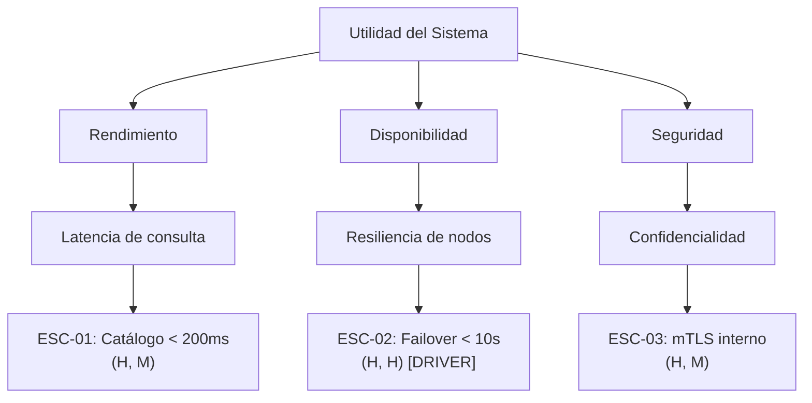

# Guía para la Elaboración del Árbol de Utilidad (Utility Tree)

El **Árbol de Utilidad** (*Utility Tree*) es una herramienta fundamental del método ATAM (*Architecture Tradeoff Analysis Method*) del SEI para explicitar, priorizar y operacionalizar los requerimientos de atributos de calidad del sistema.

Para una especificación exhaustiva de la matriz de priorización y representaciones visuales, consultar [Esquema del Árbol de Utilidad](./utility-tree-schema.md).

---

## 1. Estructura Jerárquica de 4 Niveles

El árbol descompone la noción abstracta de "bondad" o "utilidad" del sistema en escenarios medibles:

```text
Utilidad (Raíz: Excelencia operacional y adecuación técnica)
├── Atributo de Calidad (Nivel 1: ej. Rendimiento)
│   ├── Sub-atributo / Refinamiento (Nivel 2: ej. Latencia de transacción)
│   │   └── Escenario Específico (Nivel 3: ej. ESC-01) [Prioridad: (H, H)]
│   └── Sub-atributo / Refinamiento (Nivel 2: ej. Throughput de procesamiento)
│       └── Escenario Específico (Nivel 3: ej. ESC-02) [Prioridad: (H, M)]
└── Atributo de Calidad (Nivel 1: ej. Disponibilidad)
    └── Sub-atributo / Refinamiento (Nivel 2: ej. Tolerancia a fallos de BD)
        └── Escenario Específico (Nivel 3: ej. ESC-03) [Prioridad: (H, H)]
```

---

## 2. Esquema de Priorización (Matriz 2D)

Cada escenario en las hojas del árbol debe calificarse con una tupla de dos dimensiones:

$$\mathbf{(Importancia\ para\ el\ Negocio,\ Dificultad\ o\ Riesgo\ T\acute{e}cnico)}$$

Valores: **H** (High / Alto), **M** (Medium / Medio), **L** (Low / Bajo).

### Matriz de Prioridad y Significado
* **(H, H) - Driver Arquitectónico Crítico:** Alta importancia de negocio y alta complejidad/riesgo técnico. Requiere diseño temprano, prototipado y validación de tradeoffs.
* **(H, M) - Requerimiento Primario:** Clave para el negocio, abordable mediante patrones arquitectónicos estándar.
* **(M, H) - Riesgo Técnico Latente:** Complejo técnicamente pero de valor de negocio moderado; requiere seguimiento y análisis de simplificación.
* **(M, M) - Requerimiento Estándar:** Esfuerzo e impacto moderados; prácticas de desarrollo convencionales.
* **(L, \*) - Secundario:** No justifica complejidad arquitectónica adicional.

---

## 3. Presentación Canónica

### Tabla de Árbol de Utilidad
| Atributo de Calidad | Sub-atributo / Categoría | ID | Escenario Resumido | Prioridad (Negocio, Riesgo) |
| :--- | :--- | :--- | :--- | :---: |
| **Rendimiento** | Latencia de consulta | ESC-01 | Usuario consulta catálogo bajo carga pico (10.000 req/s); respuesta en < 200 ms. | **(H, M)** |
| **Disponibilidad** | Resiliencia ante caída de nodo | ESC-02 | Falla inesperada de un nodo del cluster; conmutación por error automática en < 10 s sin pérdida de transacciones confirmadas. | **(H, H)** |
| **Seguridad** | Confidencialidad de datos | ESC-03 | Tráfico entre microservicios en red pública; comunicación encriptada mediante TLS 1.3 mTLS. | **(H, M)** |
| **Modificabilidad** | Integración de nuevo proveedor | ESC-04 | Desarrollador añade nueva pasarela de pago en $\le 16\text{ h-p}$ sin modificar el core de facturación. | **(M, L)** |

### Diagrama Mermaid

