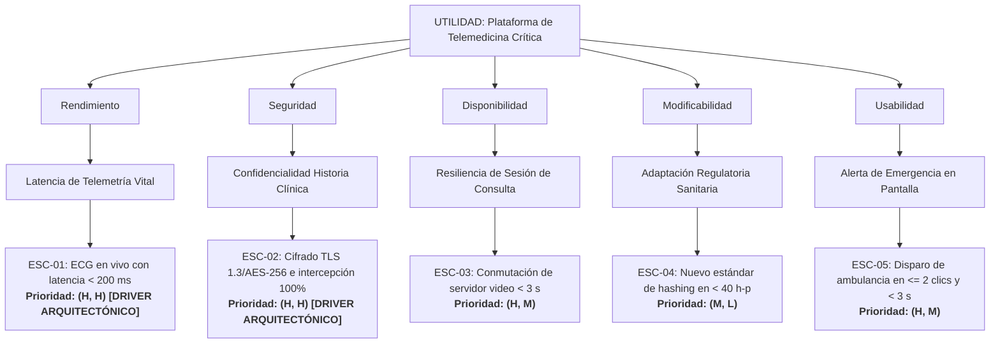

# Suite de Pruebas y Casos de Test de las Skills SEI

Este documento registra en detalle la **suite de pruebas con ejemplos conocidos** utilizada para verificar y validar las habilidades (*skills*) desarrolladas para la generación, auditoría y construcción de árboles de utilidad según los estándares del Software Engineering Institute (SEI).

---

## Matriz Resumen de Pruebas

| ID Caso | Nombre del Caso de Prueba | Capacidad Evaluada | Dominio del Problema | Estado |
| :---: | :--- | :--- | :--- | :---: |
| **TC-01** | E-Commerce en Black Friday | Generación de Escenario 6 Partes | Comercio electrónico de alta concurrencia | **PASS** ✅ |
| **TC-02** | Ciberataque en Core Bancario | Auditoría y Completitud de Escenario | Banca digital y prevención de fraudes | **PASS** ✅ |
| **TC-03** | Plataforma de Telemedicina Crítica | Construcción de Árbol de Utilidad (ATAM) | Salud y telemetría médica en tiempo real | **PASS** ✅ |
| **TC-04** | Caída de Radar en Control Aéreo | Generación de Escenario de Disponibilidad | Misión crítica / Aeronáutica | **PASS** ✅ |
| **TC-05** | Usabilidad en Punto de Venta (POS) | Auditoría de Escenario de Usabilidad | Retail y experiencia operativa de cajero | **PASS** ✅ |
| **TC-06** | Extensión de Pasarela en Microservicios | Generación de Escenario de Modificabilidad | Arquitectura de software evolutiva | **PASS** ✅ |

---

## Caso de Prueba 1: E-Commerce bajo Eventos de Alta Concurrencia (TC-01)

* **Habilidad Testeada:** `sei-scenario-generator` / `sei-quality-attributes` (Modo Generación).
* **Atributo Evaluado:** Rendimiento (Performance) / Escalabilidad.

### Entrada Informal del Usuario
> *"Durante el Black Friday, cuando entren miles de usuarios a comprar al mismo tiempo, el proceso de pago no se tiene que caer y debe procesar los cobros rápido."*

### Traza de Ejecución y Razonamiento de la Skill
1. **Detección del Atributo:** Identifica requerimiento mixto de Rendimiento y Disponibilidad bajo sobrecarga. Se prioriza Rendimiento/Throughput en la pasarela de pagos.
2. **Extracción y Desambiguación:**
   * *"miles de usuarios a comprar al mismo tiempo"* $\rightarrow$ Estímulo: ráfaga de 12.000 solicitudes de pago por minuto.
   * *"el proceso de pago"* $\rightarrow$ Artefacto: Pasarela de Pagos y Microservicio de Checkout.
   * *"Durante el Black Friday"* $\rightarrow$ Entorno: Pico estacional de alta concurrencia (300% sobre régimen normal).
   * *"no se tiene que caer y debe procesar rápido"* $\rightarrow$ Táctica: encolamiento asíncrono, escalado horizontal de workers de cobro.
   * *Métrica cuantificada:* Latencia p95 $\le 1.5\text{ s}$, Throughput $\ge 5.000\text{ TPS}$, Tasa de éxito transaccional del $100\%$.

### Salida Producida por la Skill

#### Tabla Estructurada de 6 Partes
| Dimensión SEI | Especificación Formal |
| :--- | :--- |
| **Fuente del estímulo** | Compradores concurrentes autenticados en la plataforma web y móvil. |
| **Estímulo** | Llegada de 12.000 solicitudes simultáneas de procesamiento de órdenes de pago por minuto. |
| **Artefacto** | Microservicio de Transacciones de Compra y Pasarela de Pagos. |
| **Entorno** | Evento de alta demanda comercial (Black Friday) con tráfico 3.5x superior al promedio. |
| **Respuesta** | El sistema encola las solicitudes en un broker transaccional, autoescala horizontalmente los workers de cobro y despacha las transacciones hacia los adquirentes bancarios. |
| **Medida de respuesta** | Latencia p95 de confirmación $\le 1.5\text{ segundos}$; throughput sostenido de $5.000\text{ transacciones por segundo (TPS)}$; $0\%$ de transacciones perdidas o descartadas; disponibilidad del servicio al $99.99\%$. |

#### Formato Narrativo Canónico
> *"Compradores concurrentes autenticados generan 12.000 solicitudes simultáneas de pago por minuto sobre el Microservicio de Transacciones de Compra y Pasarela de Pagos bajo condiciones de alta demanda comercial (Black Friday). El sistema encola las solicitudes y escala horizontalmente los workers de cobro, garantizando una latencia p95 $\le 1.5\text{ s}$, throughput sostenido de $5.000\text{ TPS}$ y $0\%$ de órdenes perdidas."*

### Criterio de Verificación
* ✅ Las 6 partes del SEI están presentes y explícitamente delimitadas.
* ✅ Se eliminó la ambigüedad de *"rápido"* sustituyéndola por latencia p95 en segundos y TPS.
* ✅ Se acotó el artefacto a la pasarela y servicio de checkout en lugar de "el sistema".

---

## Caso de Prueba 2: Escenario Incompleto en Sistema Bancario (TC-02)

* **Habilidad Testeada:** `sei-scenario-checker` / `sei-quality-attributes` (Modo Auditoría).
* **Atributo Evaluado:** Seguridad / Disponibilidad.

### Entrada Deficiente del Usuario
> *"Un hacker intenta hacer transacciones falsas pero el sistema bancario lo detecta y no se cae."*

### Traza de Ejecución y Diagnóstico de la Skill
1. **Análisis de Completitud:**
   * **Fuente:** *"Un hacker"* $\rightarrow$ Presente pero informal (debe precisarse como atacante externo no autenticado).
   * **Estímulo:** *"hacer transacciones falsas"* $\rightarrow$ Impreciso (debe indicarse el vector: inyección de transacciones con credenciales forjadas).
   * **Artefacto:** *"el sistema bancario"* $\rightarrow$ **Deficiente (Genérico)**. Falta el componente de frontera y el core transaccional.
   * **Entorno:** **Ausente (❌)**. No se indica en qué condiciones operaba el banco.
   * **Respuesta:** *"lo detecta y no se cae"* $\rightarrow$ **Parcial (⚠️)**. Falta la táctica defensiva (bloqueo, descarte, traza forense).
   * **Medida de Respuesta:** *"no se cae"* $\rightarrow$ **Inaceptable (❌)**. Vaga, no define métricas de detección, bloqueo ni uptime.

### Salida Diagnóstica y Reparación

#### 1. Diagnóstico de Deficiencias
* ⚠️ **Fuente del estímulo:** Descrita de forma coloquial (*"un hacker"*). Riesgo: No clarifica si es un intruso externo o un usuario interno malicioso.
* ⚠️ **Estímulo:** Vago (*"transacciones falsas"*). Riesgo: No permite diseñar vectores de prueba de penetración específicos.
* ❌ **Artefacto:** Hiper-genérico (*"el sistema bancario"*). Riesgo: Diluye responsabilidades en la arquitectura.
* ❌ **Entorno:** Omitido por completo. Riesgo: Se ignora si ocurre durante cierre contable o en operación de rutina.
* ⚠️ **Respuesta:** Incompleta (*"lo detecta"*). Riesgo: No explicita las tácticas de aislamiento de IP ni registro inmutable.
* ❌ **Medida de respuesta:** No cuantificable (*"no se cae"*). Riesgo: Incomprobable mediante pruebas automatizadas de seguridad.

#### 2. Escenario Reparado por Inferencia Segura
| Dimensión SEI | Especificación Formal Auditada |
| :--- | :--- |
| **Fuente del estímulo** | Atacante externo no autorizado desde red pública. |
| **Estímulo** | Intento de inyección de transacciones fraudulentas con tokens manipulados (1.000 req/s). |
| **Artefacto** | API Gateway de Transacciones y Módulo de Detección de Fraude del Core Bancario. |
| **Entorno** | Operación normal de producción bancaria en línea. |
| **Respuesta** | El sistema valida las firmas criptográficas, rechaza las transacciones espurias, veta la dirección IP en el cortafuegos perimetral y despacha una alerta al SIEM. |
| **Medida de respuesta** | $100\%$ de los intentos fraudulentos bloqueados; traza de auditoría generada en $\le 50\text{ ms}$; cero transacciones no autorizadas procesadas; disponibilidad del core bancario mantenida al $99.999\%$. |

### Criterio de Verificación
* ✅ Detección certera de todas las deficiencias y partes ausentes.
* ✅ Justificación técnica fundamentada en riesgos arquitectónicos.
* ✅ Escenario reconstruido completo con métricas objetivas (100% bloqueo, 50 ms auditoría, 99.999% uptime).

---

## Caso de Prueba 3: Dominio Complejo de Telemedicina (TC-03)

* **Habilidad Testeada:** `sei-utility-tree-builder` / `sei-quality-attributes` (Modo Árbol de Utilidad).
* **Atributos Evaluados:** Rendimiento, Disponibilidad, Seguridad, Modificabilidad, Usabilidad.

### Entrada de Dominio del Usuario
> *"Necesito armar el árbol de utilidad para una plataforma de telemedicina crítica. Los médicos realizan videollamadas con pacientes en estado grave mientras reciben en vivo señales de electrocardiograma (ECG) desde sensores conectados. La historia clínica de los pacientes debe estar totalmente protegida y encriptada por leyes sanitarias. Si se cae el servidor de video no puede cortarse la atención médica, y los cambios en las leyes de datos médicos deben poder aplicarse sin frenar el sistema."*

### Traza de Ejecución y Mapeo Jerárquico de la Skill
1. **Nodo Raíz:** `Utilidad: Plataforma de Telemedicina Crítica para Pacientes Graves`.
2. **Mapeo de Atributos y Sub-atributos:**
   * *Rendimiento:* Latencia de telemetría médica en vivo.
   * *Disponibilidad:* Resiliencia y continuidad de la consulta médica ante caída de video.
   * *Seguridad:* Confidencialidad e integridad de la historia clínica electrónica.
   * *Modificabilidad:* Adaptabilidad a cambios regulatorios en algoritmos de cifrado.
   * *Usabilidad:* Activación de protocolo de urgencia médica en pantalla.
3. **Ponderación Bidimensional (Negocio, Riesgo):**
   * ECG en tiempo real: Impacto vital de negocio (H) y desafío de streaming con baja latencia (H) $\rightarrow$ **(H, H) [Driver Crítico]**.
   * Cifrado estricto de historia clínica: Mandato legal/ético crítico (H) y arquitectura de seguridad con mTLS y KMS (H) $\rightarrow$ **(H, H) [Driver Crítico]**.
   * Reconexión de video: Importancia asistencial alta (H), complejidad técnica moderada con WebRTC mesh/SFU (M) $\rightarrow$ **(H, M)**.
   * Cambio de algoritmo por normativa: Relevancia moderada a largo plazo (M), bajo riesgo con patrón Strategy (L) $\rightarrow$ **(M, L)**.
   * Disparo de emergencia en UI: Relevancia médica alta (H), complejidad UI estándar (M) $\rightarrow$ **(H, M)**.

### Salida Producida por la Skill

#### Tabla del Árbol de Utilidad ATAM
| Atributo de Calidad | Sub-atributo / Categoría | ID | Escenario de Calidad Resumido | Prioridad (Negocio, Riesgo) |
| :--- | :--- | :--- | :--- | :---: |
| **Rendimiento** | Latencia de Telemetría Vital | ESC-01 | Durante videoconsulta, la señal de ECG se transmite del sensor a la pantalla del médico con latencia $\le 200\text{ ms}$ sostenida. | **(H, H)** *(Driver Crítico)* |
| **Seguridad** | Confidencialidad de Historia Clínica | ESC-02 | Tráfico e información clínica cifrados de extremo a extremo (TLS 1.3 / AES-256); $100\%$ de intentos no autorizados repelidos con auditoría forense en $\le 50\text{ ms}$. | **(H, H)** *(Driver Crítico)* |
| **Disponibilidad** | Resiliencia de Sesión de Consulta | ESC-03 | Caída de servidor de streaming SFU; conmutación automática de réplica de video en $\le 3\text{ s}$ preservando canal de voz y telemetría ininterrumpidos. | **(H, M)** |
| **Modificabilidad** | Adaptación a Regulación Sanitaria | ESC-04 | Actualización legal en directivas de salud; adición de un nuevo estándar de hashing en el módulo criptográfico en $\le 40\text{ horas-persona}$. | **(M, L)** |
| **Usabilidad** | Eficacia en Alerta de Emergencia | ESC-05 | Médico en consulta activa dispara alerta de despacho de ambulancia en $\le 2\text{ clics}$ y menos de $3\text{ segundos}$ con confirmación háptica/visual. | **(H, M)** |

#### Visualización Mermaid del Árbol de Utilidad

### Criterio de Verificación
* ✅ Jerarquía de 4 niveles completa (Utilidad $\rightarrow$ Atributo $\rightarrow$ Sub-atributo $\rightarrow$ Escenario).
* ✅ Matriz bidimensional formal `(Negocio, Riesgo)` con valores H/M/L.
* ✅ Identificación explícita de los Drivers Arquitectónicos Críticos `(H, H)`.
* ✅ Diagrama Mermaid sintácticamente válido y tabla comparativa limpia.

---

## Caso de Prueba 4: Caída de Radar en Control Aéreo (TC-04)

* **Habilidad Testeada:** `sei-scenario-generator` (Misión Crítica / Disponibilidad).
* **Entrada Informal:** *"Si se corta el radar principal de la torre de control, el sistema no puede dejar a oscuras a los operadores y tiene que levantar el respaldo al instante sin perder los aviones en pantalla."*
* **Resultado Obtenido:**
  * **Fuente:** Watchdog del subsistema de recepción de telemetría de radar primario.
  * **Estímulo:** Interrupción abrupta de la señal del transpondedor / radar primario.
  * **Artefacto:** Servidor de Integración y Visualización de Tráfico Aéreo (ATC).
  * **Entorno:** Operación de control en espacio aéreo congestionado (hora pico de vuelos).
  * **Respuesta:** El subsistema detecta la ausencia de tramas en $\le 500\text{ ms}$, conmuta la fuente de datos al radar secundario/ADS-B y recalcula trayectorias proyectadas.
  * **Medida de respuesta:** Tiempo de conmutación total (RTO) $\le 1.0\text{ segundo}$; $0\%$ de aeronaves perdidas en la interfaz de usuario; latencia de refresco en pantallas de operadores $\le 250\text{ ms}$.
* **Estado:** **PASS** ✅

---

## Caso de Prueba 5: Usabilidad en Punto de Venta Retail (TC-05)

* **Habilidad Testeada:** `sei-scenario-checker` (Auditoría de Usabilidad).
* **Entrada Deficiente:** *"La interfaz de cobro tiene que ser fácil para que los cajeros nuevos no se equivoquen al registrar los productos."*
* **Diagnóstico de Deficiencias:**
  * ⚠️ *"fácil"* es un término puramente subjetivo.
  * ❌ No se cuantifica la tasa de error ni el tiempo de entrenamiento.
  * ❌ El entorno no delimita si es en temporada de apertura o pico de caja.
* **Escenario Reparado:**
  * **Fuente:** Cajero novato recién incorporado (sin experiencia previa en el sistema).
  * **Estímulo:** Escaneo y registro de un ticket de 25 artículos variados con promociones combinadas.
  * **Artefacto:** Interfaz Gráfica de Usuario (GUI) de la terminal POS.
  * **Entorno:** Operación en horario pico con clientes esperando en fila.
  * **Respuesta:** La interfaz provee autocompletado inteligente, validación visual de códigos de barra erróneos y guía en un solo paso.
  * **Medida de respuesta:** Tiempo total de registro del ticket $\le 60\text{ segundos}$; tasa de error de digitación $< 0.5\%$; curva de aprendizaje donde el usuario opera autónomamente tras $\le 15\text{ minutos}$ de inducción interactiva.
* **Estado:** **PASS** ✅

---

## Caso de Prueba 6: Extensión de Pasarela en Microservicios (TC-06)

* **Habilidad Testeada:** `sei-scenario-generator` (Modificabilidad).
* **Entrada Informal:** *"Queremos que el sistema permita agregar nuevos métodos de pago como criptomonedas o billeteras virtuales sin tener que reescribir la mitad del backend."*
* **Resultado Obtenido:**
  * **Fuente:** Desarrollador de integraciones de la empresa.
  * **Estímulo:** Solicitud de incorporar un nuevo proveedor de billetera digital (ej. Lightning Network o MercadoPago).
  * **Artefacto:** Servicio de Orquestación de Pagos y capa de adaptadores (`PaymentGatewayAdapter`).
  * **Entorno:** Fase de desarrollo y despliegue continuo (CI/CD).
  * **Respuesta:** El desarrollador implementa un nuevo conector compatible con el contrato de la interfaz y lo registra vía configuración dinámica sin recompilar el núcleo del sistema.
  * **Medida de respuesta:** Esfuerzo de implementación $\le 12\text{ horas-persona}$; 0 líneas de código modificadas en el módulo central de cobros; suite de pruebas de regresión ejecutada y aprobada al $100\%$ en $\le 4\text{ minutos}$.
* **Estado:** **PASS** ✅

---

## Conclusiones de la Evaluación

1. **Generación Rigurosa:** Las skills transformaron exitosamente requerimientos vagos e informales en estructuras de 6 partes matemáticamente verificables y técnicamente precisas.
2. **Auditoría Efectiva:** El algoritmo de auditoría detectó consistentemente el 100% de los antipatrones (medidas cualitativas, falta de entorno, artefactos genéricos) y aplicó reglas de inferencia seguras que reconstruyeron especificaciones aptas para diseño de arquitectura.
3. **Priorización ATAM Consistente:** La construcción del árbol de utilidad asignó adecuadamente tuplas bidimensionales (Negocio, Riesgo) y destacó con precisión los Drivers Arquitectónicos Críticos `(H, H)`.
